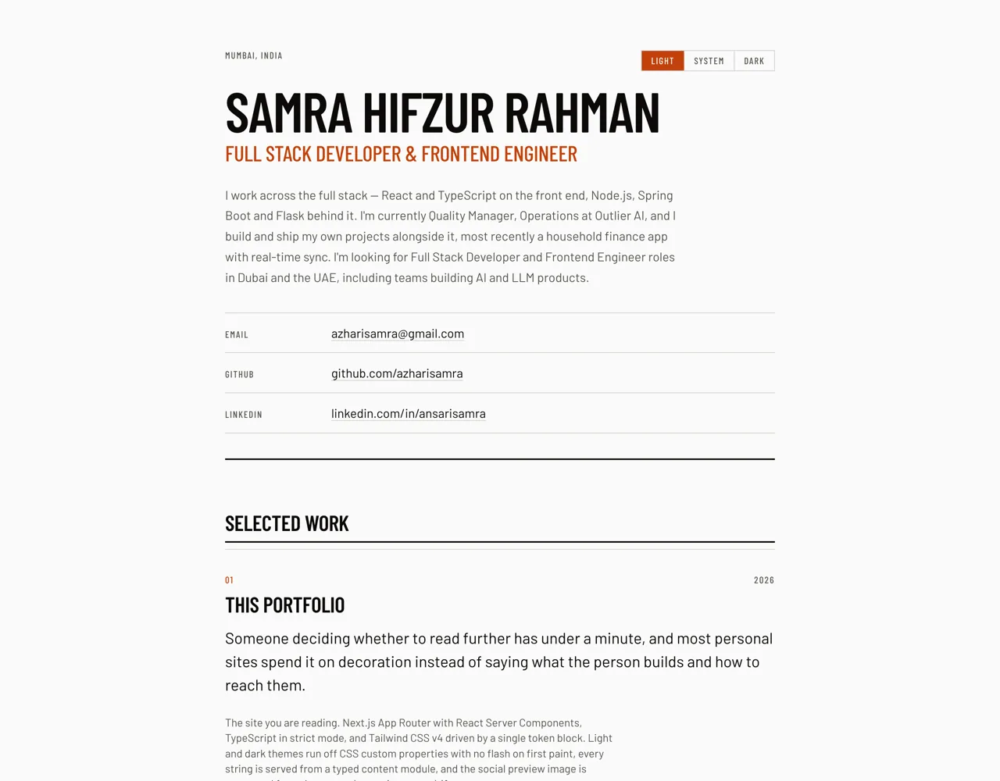

# Samra Hifzur Rahman, Portfolio

Personal portfolio and CV site. Live at **<https://samraazhari.netlify.app>**.



## Stack

- Next.js (App Router, React Server Components)
- React 19, TypeScript in strict mode
- Tailwind CSS v4, configured CSS-first via a single `@theme` block
- Vercel AI SDK with the Google provider (Gemini)
- Vitest for unit tests
- Deployed on Netlify

## Notable implementation details

**The Q&A endpoint is grounded, and the grounding is the point.** `POST /api/ask`
assembles its system prompt from the content modules at request time rather than
from a hand-written description, so an answer cannot claim experience the site
does not list. The prompt instructs the model to state plainly when something is
absent instead of hedging, and refuses to inflate a single mention into "extensive
experience". Requests are bounded on four axes (input length, output tokens,
per-IP rate, and a global daily cap) because the endpoint is public and every
call costs money. See `src/lib/ask/`.

**Streaming errors are reported with honest status codes.** `streamText` is lazy:
returning its response directly means an upstream failure arrives after the HTTP
headers have already been sent, so an authentication error reaches the browser as
`200 OK` with an empty body. The route pulls the first chunk before committing a
status, and captures provider errors through `onError`, which the SDK uses
instead of throwing, so an API failure is distinguishable from a genuinely empty
completion. Everything after the first token still streams.

**Content lives in typed modules, not in components.** Every string on the page is
exported from `src/content/` and annotated with an interface. A missing field or a
typo'd key is a compile error rather than a blank space discovered in production.
The same modules feed the page, the Q&A grounding context, the JSON-LD, and the
Open Graph image.

**The Open Graph image is generated from that content layer.** `opengraph-image.tsx`
renders a 1200×630 card at build time via `next/og`, reading the name, role and
location from `src/content/profile.ts`. A social preview generated from the same
source as the page cannot drift out of sync with it, which is the usual failure
mode for a hand-exported PNG.

**Theming is flash-free and toggle-driven.** A small blocking script in `<head>`
reads the stored preference and sets a class on `<html>` before first paint, so
the correct theme is present in the first frame rather than applied after
hydration. Both palettes are CSS custom properties consumed through Tailwind's
`@theme inline`, so one set of utilities serves both. The control is a
`role="radiogroup"` with a roving tabindex, giving one tab stop and arrow-key
navigation, and it reads `localStorage` through `useSyncExternalStore` rather than copying it
into state inside an effect.

## Local setup

**Prerequisites:** Node.js 20 or newer, and npm.

```bash
git clone https://github.com/azharisamra/Portfolio.git
cd Portfolio
npm install
```

**Environment variables.** Both are optional; see `.env.example`.

| Variable                       | Required | Purpose                                                                                                                                                                   |
| ------------------------------ | -------- | ------------------------------------------------------------------------------------------------------------------------------------------------------------------------- |
| `GOOGLE_GENERATIVE_AI_API_KEY` | No       | Enables the Q&A panel. Without it the panel does not render and the rest of the site is unaffected. Free key from [Google AI Studio](https://aistudio.google.com/apikey). |
| `NEXT_PUBLIC_SITE_URL`         | No       | Overrides the production origin used for canonical URLs, the sitemap and the OG image. Defaults to the deployed URL. Set it on preview deployments.                       |

```bash
cp .env.example .env.local   # then fill in the values you want
```

The page is statically prerendered, so `GOOGLE_GENERATIVE_AI_API_KEY` must be
available **at build time**, not only to functions at runtime. Scoping it to
functions on the host leaves the API route working while the panel never renders.

**Run and build:**

```bash
npm run dev           # http://localhost:3000
npm run build         # production build
npm run start         # serve the production build

npm test              # vitest run
npm run typecheck     # next typegen && tsc --noEmit
npm run lint          # eslint
npm run format        # prettier --write
npm run format:check  # prettier --check
```

## Architecture

Site content is exported from `src/content/` as typed TypeScript modules,
`profile.ts`, `experience.ts`, `projects.ts`, `education.ts`, `certifications.ts`,
`skills.ts`, rather than being written into JSX or loaded from JSON.

Components receive data; they do not contain facts. A section is a rendering
decision, and the content it renders is a separate, independently reviewable
thing.

This buys three concrete properties.

**Shape violations are compile errors.** Each module annotates its export against
an interface, so removing a required field, misspelling a key, or assigning the
wrong type fails `npm run typecheck` instead of rendering an empty element. TypeScript
modules rather than JSON is a deliberate choice: JSON parses at runtime and is
structurally unchecked, so the same mistake would only surface in the browser.

**One fact has one home.** The bio appears in the page, the meta description, the
JSON-LD `Person` block, the Open Graph card and the Q&A grounding context. Each of
those reads `profile.ts`. There is no second copy to update and therefore no way
for the social preview to describe someone the page no longer describes.

**Optional data degrades honestly.** Fields such as `liveUrl`, `repoUrl` and
`image` are optional in their interfaces, and every consumer branches on presence.
A project without a live URL renders without a link rather than with a placeholder
that 404s. That constraint is what makes it safe to commit an incomplete entry.

The Q&A endpoint is the clearest payoff. Because its grounding context is built
from the same modules the page renders, the answers and the page cannot disagree.
Editing `experience.ts` changes both in one step.
